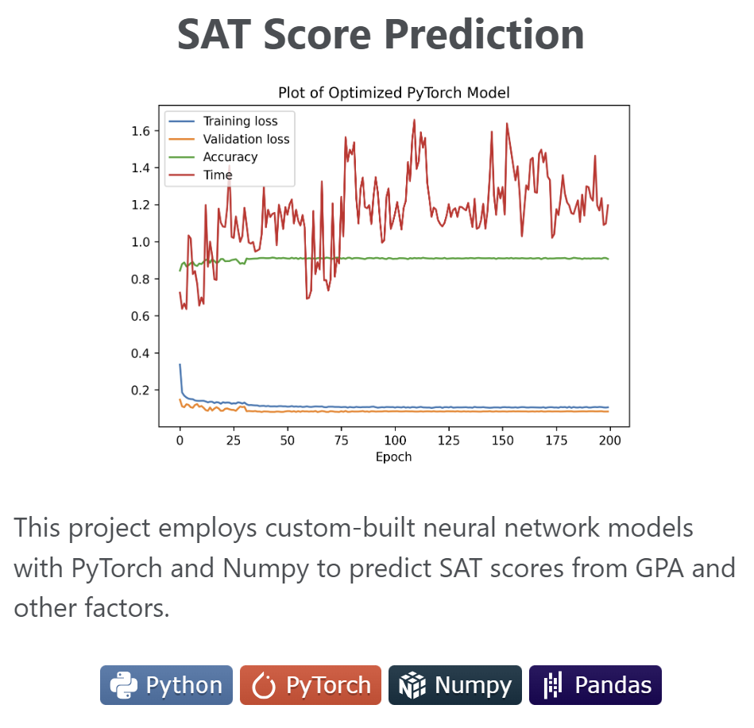
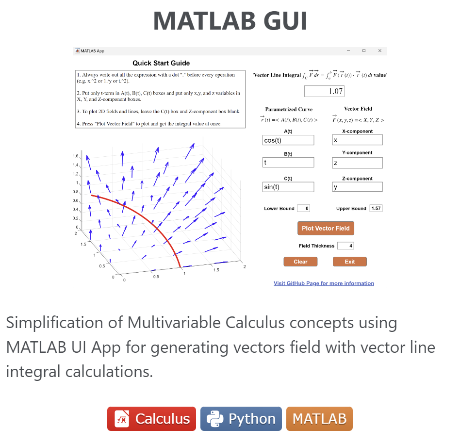

👉 Introduction
======
-----------------
Hi there!👋 I am Huy Nguyen, a second-year student at the University of Virginia majoring in Computer Science with a minor in Applied Mathematics. 

Originally from Ho Chi Minh City, Vietnam, I moved to the U.S. to further my studies as an international student - with a long-term goal of pursuing a Ph.D. in Computer Science.

> The more you sleep, the higher your GPA.

 

🎓 Education
======
------------------
<table style="border-collapse: collapse; border: none;">
  <tr>
    <td rowspan="2" style="border: none; padding-right: 5px; vertical-align: top;"></td>
    <td style="border: none; font-weight: bold; font-size: 20px; line-height: 1; padding-bottom: 0;">University of Virginia, 2026</td>
  </tr>
  <tr>
    <td style="border: none; font-size: 15px; line-height: 1; padding-top: 0;">B.S. Computer Science and Minor in Applied Mathematics - GPA: 3.989</td>
  </tr>
</table>

 

💼 Experience 
======
------------------
**Undergraduate Research Assistant - Insight Computer Architecture Lab**  
*August 2023 - Present*  

**Undergraduate Research Assistant - Enhancing Learning through Interactive GUI, UVA**  
*August 2023 - Present*

**Project Intern - Machine-learned potentials for high-entropy alloys properties, UVA**  
*April 2023 - Present*

**Developer Intern, SHIFT ASIA - Ho Chi Minh City**  
*May 2023 - August 2023*

**Teaching Assistant and Grader, UVA**  
*August 2023 - Present*

**CORE Scholar Peer Academic Mentor, UVA**  
*August 2023 - Present*

 

💻 Feartured Projects
======
---------------

<!-- Displayed Table with Image, should be in the same dimension-->

<table style="border-collapse: collapse; border: none;">
  <tr>
    <!-- Project 1 with just the image created below-->
    <td style="border: none; width:50%;">
      

        
      

    </td>
    <!-- Project 2 with just the image-->
    <td style="border: none; width:50%">
      

        
      

    </td>
  </tr>
</table>

<!-- Table for generating the image to get clicking effect-->
<!-- For future project, generate the image so that it have the same dimensions-->

<!--
<table>
  <tr>
    <td width="50%" onclick="window.location='URL_TO_PROJECT_1';" style="cursor: pointer;">
      <h1 align="center">SAT Score Prediction</h1>
      

        
      

      
This project employs custom-built neural network models with PyTorch and Numpy to predict SAT scores from GPA and other factors.

      

        
        
        
        
      

    </td>
    <td width="50%" onclick="window.location='URL_TO_PROJECT_2';" style="cursor: pointer;">
      <h1 align="center">MATLAB GUI</h1>
      

        
      

      
Simplification of Multivariable Calculus concepts using MATLAB UI App for generating vectors field with vector line integral calculations.

      

        
        
        
      

    </td>
  </tr>
</table>
-->
